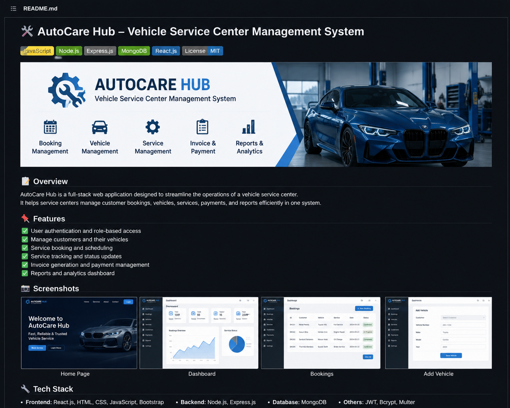
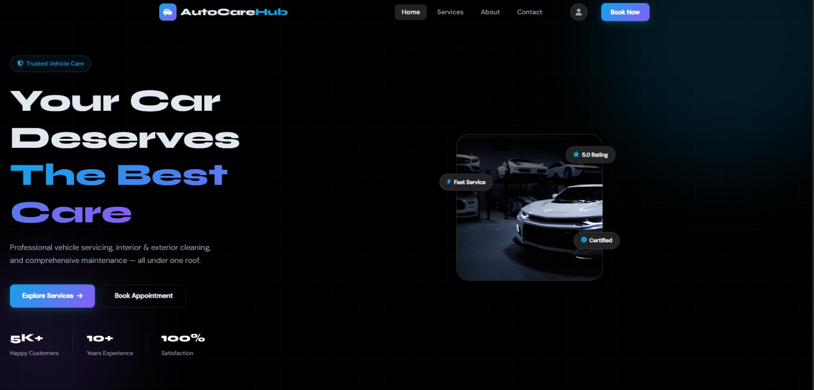

AutoCare Hub

## Overview

AutoCare Hub is a web-based Vehicle Service Center Management System designed to provide customers with information about vehicle maintenance and service solutions. The project includes multiple web pages for displaying services, contact information, and company details with a responsive and user-friendly interface.

## Features

Service booking and appointment management  
Vehicle service tracking system (real-time status updates)  
Customer and vehicle record management  
Service history tracking  
PDF report generation for invoices and service details  
Admin dashboard for managing workshop operations  
Easy search and filtering of service records

## Technologies Used

HTML5
CSS3
JavaScript

## Project Structure

autocare-hub/
│
├── index.html # Home page
├── about.html # About page
├── services.html # Services page
├── contact.html # Contact page
├── style.css # Main stylesheet
└── script.js # JavaScript functionality

## Dashboard UI

## How to Run the Project

Download or clone the project.
Extract the project folder if downloaded as a ZIP file.
Open the index.html file in any web browser.

## System Functionalities

Display vehicle service information
Provide contact details for customer communication
Showcase available vehicle maintenance services
Improve user interaction with responsive web design

## Future Improvements

Add user authentication system
Add online booking functionality
Integrate database support using MongoDB/MySQL
Add payment gateway integration
Implement admin dashboard for service management

## Learning Outcomes

This project helped improve knowledge in:

Frontend web development
Website structuring using HTML
Styling and responsive design using CSS
Interactive functionality using JavaScript
Basic software project organization

Author

A.P.K. Lakshika
